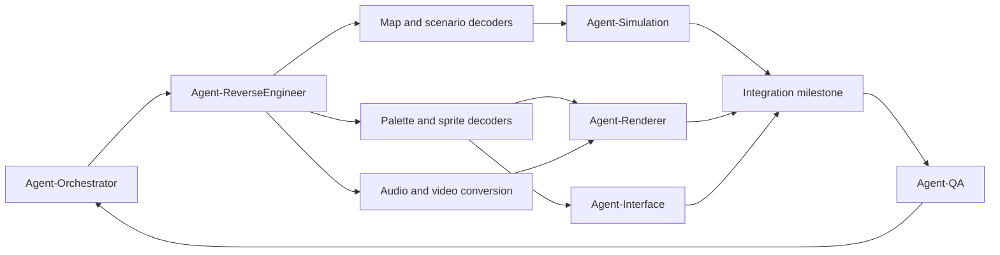

# Dark Colony Browser Port Architecture

## Current gate

Phase 1 is complete. Phase 2 sprite, standard-animation, terrain-bank, and map
structure conversion is operational: all 284 SPR archives decode, 164 of 177 FIN
files emit structured timelines, all 4 BTS banks decode, and all 108 MAP bundles
export. Standard media and all four Red Book tracks convert to browser-native
formats. Original unit, weapon, dependency, and scenario tables also export as
versioned JSON with source hashes. The browser inspects raw frames, named FIN
states, keyed terrain, video, and audio, while the live simulation consumes the
original first-tier combat and worker stats. HUMAN01 and ALIEN01 now load their
original 96x84 MAP layers, SCN placements, team-0 `c>0` TRO reinforcements,
GAMESTAT rosters, and TRSC/GRAY/BEAC/CENT/SALA visuals. MAP layout and BTS lookup
are now executable-verified: two tile references per cell precede a separate
attribute plane. The browser uses source PTH infantry eligibility, correctly
oriented terrain, fixed 512x452 logical rendering, directional FIN body states,
collision-aware formations, radar, control groups, and source voice/weapon cues.
Static mission objects now have simulation-owned HP/death and can be attacked
when visible, including on blocked terrain. Source team/type victim-loss counters
are updated from authoritative deaths. A deterministic browser guard policy
acquires nearest visible enemies using source sight radii; original AI priorities
are not claimed. FIN child composition now uses verified placement and duration
conversions, with explicit diagnostics for unsupported native effects.
The complete port remains unfinished. See the phase matrix below; helper tests
and opening-mission browser passes do not certify campaign completion.

### Newest briefstatus: ALIEN01 repair, 2026-09-21

[ALIEN01 repair and evidence](docs/alien-repair-20260921.md): the default browser
guard path now loads both SAWS and SAUC, fixing the carrier `MIDDLE` fatal at
tick 16 without changing science `SAUCSTAND`. Original five-unit delivery,
trusted main-handler Move input and exact in-memory restore are confirmed;
the existing Human save is preserved. Unconfigured construction rendering no
longer clones full state repeatedly. Recovery UI/audio cleanup and modified-key
guards are fixed; mode5 layer-1 support remains bounded, not full-scene parity.
Main's actual default-loader browser runs now reach ready WIN/LOSS at 6945/2465,
rendering every tick: shots 785/267, deaths 45/1, commands 88/10, outcome/reason
0/1 and 1/2, both diagnostics null. This is source-aware public-API strategy on
a controlled clock, with no actor/damage/funds injection, not manual/native parity.
Mobile 390x844 loss/Retry fits after parent resize observation; trusted Retry
reaches fresh tick 220 with five units. Real modified shortcuts issue no Stop;
plain S/M work. Earlier full: **2,803 tests, 2,799 passed, zero failed, four
skipped**; later focused **112/112** includes recorded, not fresh, long outcomes.
Final isolated main **18/18** covers later modifiers/observer; totals are not
additive. Main reports final strict/build passing, 653.14 kB JS / 204.76 kB gzip,
4.42 s, size warning retained. No rAF FPS claim. The clock wrapper is restored;
main still must restore the prototype `view.stop` wrapper and remove test globals.
Phases 1-2 retain pinned acceptance; phases 3-5 remain partial, and ALIEN02
admission remains blocked. This note updates current repair status only;
the round-13 report and historical limitations below remain preserved.

### Historical briefstatus: round 13, 2026-09-20

[Round 13 independent acceptance audit](docs/acceptance-round13-20260920.md)
supersedes current-status claims only; older reports and the sections below
remain historical. **All phases are NOT accepted.** Phases 1-2 retain acceptance
only in their pinned scope; phases 3-5 remain partial and not accepted. Original
HUMAN02/ALIEN02 campaign admission and the shared native TRO/AI/production/
resources/combat scheduler remain closed. AI, statics and transports have existing
implementations and bounded evidence; their absence is not the remaining gate.

Latest completed full check: `/tmp/dc-round13-integrated-20260920.log`,
**2,685 tests, 2,681 passed, zero failed, four skipped**; typecheck/build passed,
JS 644.16 kB / gzip 202.11 kB, over-500-kB warning retained. Later full-ground
visibility and mode3 capture-completeness changes are not certified by that full.
The separate `/tmp/dc-round13-final-focused-20260920.log`, running at handoff,
now has a completed footer: **155 tests, 155 passed, zero failed/skipped**.
These are separate focused results, never additions to full-suite totals.

Authenticated source visibility now uses the actual original tree and CITY/ground
workers. Fresh HUMAN02 host coverage retains all 21 actors, admits all 14 eligible
producers with no exclusions, and matches 411 sight/exploration and 10,487 ordered
writes. MAIN reports a full-producer browser pass with exact restore and no
diagnostic. ALIEN02's 41 eligible/44 actors is pure/native coverage, not combat-host
admission. New 37-case/1,038,548-write evidence preserves the old 28-case/196,473-write
oracle and its hash. The bounded browser sequence separately shows 129/129,
clear 0/129, exact restore and recompute 129/129 at actor tick 16, without a generic
clock. Natural exploration now reaches host death 614, sound 28 and CRT
1->1103527590, with an actual MissionView callback exactly once after outer
commit and fresh-provider replay. Audible browser playback and arbitrary original
mission scheduler/CRT history remain unproved, not this positive callback.

Opt-in normal handlers now queue bounded Move 2, Stop 13 and free-endpoint
attack-move 7 for the next explicit frame; there is one semantic queue and no
automatic native clock. P2 sparse raw-byte authentication is fixed: all 220 own
integer bytes must match, with adapter/view rejection tests. MAIN's Playwright
keyboard/pointer attempts delivered zero events; synthetic `isTrusted:false`
M/click/S handlers queued/restored/consumed Move once, then Stop at tick 18.
This proves API/handler behavior, not ordinary device input.

Compact projection reduced 20 advances from 7.598s to 5.161s versus the one-copy
intermediate; first-five mean 211.5ms to 88.2ms. Projection 142,322 JSON bytes versus
14,725,895 for the full snapshot retains parity and zero public snapshot reads.
Loaded FIN rendering at 0.141-0.285ms is mock Canvas CPU dispatch, not GPU timing,
60 FPS or a passed sub-50ms gate.

Mode3 is a native terrain prepass, not a body blend: 192 native frames and 65,536
arithmetic pairs match. `renderBoundedMode3` is explicit opt-in, at most 128K
pixels, with caller initialization/queue (browser filter 128); normal render,
automatic lighting and world admission are unchanged. MAIN reports real-browser
VENT19 with all four unchanged children: 334 final changed pixels, 536 changed
pre-body terrain pixels and 228 surviving native-positive pixels, unchanged
state/simulation/filter, terrain before bodies and zero SMSP draws. GLIT mode5
fallback and unverified global order remain. P2 empty `parts: []` capture
validation now rejects per entity before flattening/publication; 9 integration
tests pass separately. Mobile and MAIN's final browser cleanup remain pending.

Next small vertical: verify one bounded Move/Stop through ordinary device input,
explicit native-frame consumption and exact queued restore, without enabling an
automatic clock. Separately prove audible committed death playback. Shared native
scheduling/RNG, broader routes/types, automatic light/order ownership and sustained
performance/memory/device gates still block complete campaign acceptance.

## Source provenance

| Artifact | Bytes | SHA-256 |
| --- | ---: | --- |
| `Dark Colony.mdf` | 694,622,448 | `2211981ebb330d205b98ceb32c4d14d02c566ea8b7d5e76fbe63e4094cff80c0` |
| `Dark Colony.mds` | 838 | `d4a58a192975676b892b57a8a170f00eab11c2a89d2ccadcc00be84380fcbeb9` |
| Source ZIP | 460,643,603 | `2e3abf298ab4419bc4cbe582e805a2f6d6bcc1b8ffd09ac608cc676d1dc77211` |
| Derived data-track ISO | 487,155,712 | `3adc0e6157d35705a56014a7c1b8ccc603cc858fb4ff0d7156a7b4977931303e` |
| `asset_manifest.json` | generated | `c30023c0066ea3ad15ba7c8197ff2c828d5d380c4aee5b4a542d7c91ccb49cd7` |

Streaming hashes of both files inside the ZIP exactly match the extracted MDF
and MDS pair. The ZIP is a duplicate source, not a second disc revision.

The manifest's content-addressed source-tree hash is
`864a9a581d741252bf0ca86fadaac32e9f504b7be7a379339ce69bdb2a7be531`.
The hash covers each normalized path, byte size, and file SHA-256 in lexical
order. Timestamps and host paths are intentionally excluded.

## Disc geometry

The MDS starts with `MEDIA DESCRIPTOR`, version 1.3. It describes one session,
five tracks, and a 2,448-byte physical sector layout: 2,352 CD-sector bytes plus
96 bytes of subchannel data. macOS DiskImages does not recognize the MDF or MDS
directly.

Track 1 is Mode 1 data. Its primary volume descriptor is present at logical
sector 16 and identifies ISO-9660 volume `DCUK`, 237,869 logical blocks of 2,048
bytes each. For logical sector `n`, its user payload is:

```text
MDF offset = n * 2448 + 16
payload length = 2048
```

Copying that payload for exactly 237,869 sectors yields the validated ISO. A
150-sector gap follows the declared volume before track 2 begins.

The MDS track boundaries obey `MDF offset = (MDS sector - 150) * 2448`:

| Track | Kind | MDS sector | MDF byte offset |
| ---: | --- | ---: | ---: |
| 1 | Mode 1 data | 0 | 0 |
| 2 | CD audio | 238,169 | 582,670,512 |
| 3 | CD audio | 252,788 | 618,457,824 |
| 4 | CD audio | 258,786 | 633,140,928 |
| 5 | CD audio | 269,039 | 658,240,272 |
| lead-out | end | 283,901 | 694,622,448 |

The four audio tracks are outside ISO-9660 and are preserved directly from the
MDF. Extraction keeps each sector's 2,352-byte PCM payload and excludes its 96
subchannel bytes.

## Inventory

The validated tree contains 5,151 files in 60 directories and 481,383,122 file
bytes. A recursive byte comparison between the temporary reference extraction
and `raw_cd/` has zero differences. macOS `.DS_Store` and AppleDouble `._*`
files are excluded by the scanner because they are host metadata, not disc
content.

| Area | Files | Bytes | Treatment |
| --- | ---: | ---: | --- |
| `DC/` | 2,094 | 334,201,029 | game data |
| `DIRECTX/` | 3,033 | 142,155,570 | third-party redistributable |
| `EDITOR/` | 10 | 3,672,919 | legacy map-editor installer |
| disc root | 14 | 1,353,604 | InstallShield and install lists |

Important game-file counts are exact:

| Extension | Count | Bytes | Confirmed role |
| --- | ---: | ---: | --- |
| `.SPR` | 284 | 43,108,467 | proprietary indexed sprite archives |
| `.FIN` | 177 | 4,348,154 | named animation definitions |
| `.AVI` | 59 | 228,738,602 | cutscenes |
| `.WAV` | 259 | 13,009,773 | PCM effects, voices, and narration |
| `.MAP` | 108 | 8,076,096 | dimensioned terrain records |
| `.MTG` | 108 | 1,346,088 | one-byte map companion grids |
| `.PTH` | 108 | 8,423,760 | pathfinding companion data |
| `.SCN` | 108 | 335,886 | scenario/team definitions |
| `.TRO` | 101 | 234,032 | trigger/action scripts |
| `.O16` | 100 | 3,225,600 | fixed-size 16-bit map layers |
| `.OVH` | 100 | 1,595,914 | overhead companion layers |
| `.POP` | 56 | 4,989 | multiplayer population tables |
| `.001`-`.005` | 117 | 12,736 | mission outcome text, not video |
| `.RGB` | 21 | 688,128 | color lookup data |
| `.RMP` | 21 | 3,999,744 | color remap lookup data |
| `.BTS` | 4 | 4,900,496 | terrain tile sprite banks |

`DC/SCENARIO/MPLAYER/A2PLAY01.TRO` is the one legitimate zero-byte file. The
manifest records it rather than treating it as corruption. The disc contains no
files with `.WAR`, `.RAW`, `.PAL`, `.ACT`, `.SMK`, or MIDI extensions.

## Standard media

Every standard media file parses successfully with FFmpeg's probe:

- All 59 AVIs are 320x180, 15 FPS Cinepak video with 11,025 Hz mono unsigned
  8-bit PCM. Combined duration is 1,101.533 seconds.
- All 259 WAVs are uncompressed PCM. There are 201 unsigned 8-bit files and 58
  signed 16-bit files; combined duration is 338.493 seconds.
- All 26 GIFs are 640x480 indexed images.
- All 50 BMPs on the disc parse; the 48 game BMPs are indexed UI, cursor, or
  wallpaper assets. Cursor dimensions vary rather than using one fixed size.

All 259 WAVs convert to Ogg Opus. All 59 AVIs convert to VP9/Opus WebM for
Chromium plus H.264/AAC MP4 fallback for WebKit and proprietary-codec browsers.
Every output is FFprobe-valid and content-addressed.

FFmpeg randomizes Ogg serials and WebM TrackUIDs. The pipeline derives those
fields from source SHA-256 and repairs Ogg CRCs, making independent conversions
byte-identical. MP4 output is already byte-identical under fixed settings.

MDS track blocks are 0x50 bytes; sector size is at `+0x10`, start sector at
`+0x24`, and MDF byte offset at `+0x28`. `startOffset` is the actual CDDA start,
not a per-track pregap pointer. Each 2,448-byte sector contributes its first
2,352 bytes, excluding 96 subchannel bytes. Waveform continuity proves signed
16-bit little-endian stereo PCM (mean adjacent delta 340 versus 21,350 for
big-endian). Tracks 2-5 contain 14,619, 5,998, 10,253, and 14,862 sectors,
totaling 609.76 seconds; they export as 128 kbps stereo Ogg Opus.

## Discovered proprietary structures

### Map family

All 108 map sets satisfy the following relationships with zero exceptions,
where `w` and `h` are little-endian 32-bit values at `.MAP` offsets 0 and 4:

```text
MAP bytes = 8 + 6 * w * h
MTG bytes = 2 + w * h
PTH bytes = 65,536 + w * h
MTG[0] = w
MTG[1] = h
```

Observed dimensions are 64x56 (16), 96x84 (26), 108x92 (1), 112x98 (12),
128x112 (31), and 160x140 (22). `.O16` is
exactly 32,256 bytes for all 100 instances; 98 of 100 `.OVH` files are exactly
16,128 bytes. Their dimensions and semantics are not yet proven.

For N=w*h and source cell i, background is u16le(8+4*i), foreground is
u16le(10+4*i), and attributes are u16le(8+4*N+2*i). The previous three-reference
stride was wrong. Schema 2 exports raw key pairs, resolved BTS record-index
pairs, and separate attributes. Runtime terrain row y reads source row h-1-y.
Runtime Y increases upward; screen Y increases downward. A cell's top edge
projects runtime y+1, while its centre projects y+0.5. Tile pixels remain
unmirrored and source image rows retain their original on-screen order. Picking,
fog, facing vectors, depth sorting, camera controls, and radar use this same
conversion; reversing MAP rows alone previously broke mountain-edge joins.
See [executable evidence and corpus checks](docs/terrain-decoding.md).

Raw MAP attribute bit 5 (`0x20`) reflects the background tile horizontally;
bit 6 (`0x40`) independently reflects the foreground. World and radar apply
these flags per layer, leaving atlas pixels and row orientation unchanged.
Ignoring them caused the remaining reversed cliff faces and rectangular shore
notches. Original-x86 selector and blitter execution verifies the transforms;
see [terrain transform evidence](docs/terrain-transforms.md). The low attribute
nibble instead feeds sprite cutoff/occlusion and is not a rotation code.

PTH comprises a 256x256 next-family routing table and one family byte per cell,
not movement costs. Ground infantry excludes family 0 and 255; source SCN and
PTH rows share runtime orientation. The browser uses this verified eligibility
mask with uniform-cost A*, a browser policy rather than original cost emulation.
MTG tags map to spatial trigger IDs after Y reversal and six-bit truncation.
See [navigation evidence](docs/navigation-decoding.md). Static building footprint
tables now project native colony footprints into live mission collision. General
non-colony object footprints remain unresolved; they are not inferred from sprite bounds.

BTS is a keyed raw tile bank, not a compressed stream:

```text
u32 keySpace
u32 tileCount
u8  palette[256][3]
repeat tileCount:
  u32 key
  u8  indices[32 * 32]
```

The equation `fileBytes = 776 + tileCount * 1,028` holds for all four banks.
Every key is unique and below `keySpace`. The banks contain 4,764 tiles total;
palette index zero is the 6-bit magenta matte and exports as transparent alpha.
Generated atlases are keyed by JSON metadata and browser-inspectable.

99.902187% of genuine nonzero MAP tile keys resolve directly. The executable
zero-initializes the key lookup, so the 1,429 absent references map to BTS record
index 0, not an invented replacement tile. Foreground resolved index 0 is skipped.
HUMAN01 has four absent references; ALIEN01 has none. Earlier ~45% unresolved
claims incorrectly counted attribute words as tile keys and are superseded.

DESERT.SET and JUNGLE.SET are separate editor tables, not a missing game-map
composition stage. Their internal 3,212-byte record semantics remain unproven.

### Sprites and animation

All 284 `.SPR` files satisfy this layout with zero boundary errors:

```text
u16 flags                    0x0001 raw, 0x0081 compressed
u16 frameCount
u32 storedByteCount          compressed payload sum; raw meaning unresolved
u8  palette[256][3]          embedded RGB, usually 6-bit channels
FrameRecord frames[count]    8 bytes: u16 width, height, anchorX, anchorY
frame payloads
```

Raw payloads are concatenated `width * height` index planes. Palette index zero
is transparent. Compressed frames are each prefixed by `u32 encodedLength` and
use signed controls: a nonnegative control copies `control + 1` literal palette
indices; a negative control emits `-control` transparent pixels. The grammar
decodes 8,313 compressed and 1,417 raw frames, including 26 intentional `0x0`
sentinels, for 9,730 frames and 77,034,965 source pixels. Literal index zero
never occurs in compressed payloads, independently confirming the chroma key.

The extractor shelf-packs one deterministic RGBA PNG atlas per archive and
writes frame coordinates, dimensions, anchors, payload sizes, palette scale,
and source SHA-256 to JSON. Generated sprite output is about 27 MB. There are
107 distinct embedded palettes; the bytes are not a universal compression LUT.

The standard FIN format uses signed tag `29` (`0x001d`):

```text
i16 formatTag = 29
u16 timelineCount
u16 stateCount
u16 spriteNameCount
char spriteNames[count][8]
State states[count]          20 bytes: name[16], u16 first, u16 last
Timeline timelines[count]   164 bytes: u16 childCount, u16 field2,
                            8 x { name[16], u16 valueA, u16 valueB }
Child children[sum(count)]  22 bytes: sprite[8], u16 frame, i16 x, i16 y,
                            i16 layer, u16 flags, u16 valueA, u16 valueB
```

This parses 164 files into 2,547 named states, 18,485 timeline ticks, and 56,605
child placements. Four shipped files contain one trailing orphan child, which
is preserved. Eleven lighting FINs use tag `-3` and remain explicitly
unsupported. `ANIM.FIN` and `BUILDING.FIN` are structurally invalid authoring
artifacts and are indexed with errors. Two additional stale/debug files contain
frame references beyond the matching shipped SPR; those raw references remain
visible rather than being rewritten.

### Color data

`COLOUR.SET` is 2,360 bytes of text, not the same format as binary terrain
`.SET` files. It contains repeated `R,G,B,A` ramps with 5-bit RGB values.

All 21 `.RGB` files are exactly 32,768 bytes: executable probes verify RGB555
to palette-index lookup. Twenty `.RMP` files contain three 65,536-byte indexed
banks. Terrain uses bank 0 and ordinary FIN bodies bank 2; lighting rows are
brightness*8+selector. The 67,584-byte multiplayer variant and scenario-to-team
selector initialization remain unresolved. See [palette evidence](docs/palette-runtime.md).
The standalone indexed WebGL2 backend passed 32,256 exact RGBA pixel comparisons
in the existing embedded browser, covering all 768 bank/row combinations and both
mirrors with asymmetric masks. The live mission terrain now uses this backend
with source DESERT palette initialization, independent mirror flags and opaque
background coverage. Normal FIN body atlases use the source bank-2 team selector
and decoded run coverage through a bounded 32 MiB color cache. Unsupported native
effect modes retain diagnostics, not guessed remaps.

### Scenario and balance data

`.SCN`, `.TRO`, `.TRM`, `.MSG`, `.POP`, `.AMB`, and numbered `.001`-`.005`
files are ASCII text:

- `.SCN` records terrain bank, teams, race, money, AI level, team color selectors,
  dependencies, allies, AI slots, and city data.
  Percent labels follow values; their former header interpretation shifted every
  team field. Native loader evidence and corrected exports are documented in
  [SCN team fields](docs/scenario-team-fields.md).
- `.TRO`/`.TRM` is a trigger/action language with conditions and actions such
  as `waypoint`, `reinforce`, `newtype`, `msg`, `bail`, and `abduct`.
- `.MSG` files contain numbered text blocks referenced by TRO `msg` actions.
  All 44 files parse into 347 messages with one consistent grammar.
- Campaign `.TXT` files contain formatted briefing prose and explicit
  `MISSION OBJECTIVES` lists. Formatting codes remain preserved in `rawText`,
  while generated JSON also provides plain text and joined objective lines.
- Numbered files contain success/failure narrative using `~N` formatting codes.
- `GAMESTAT.TXT` declares 106 entity records and explicitly labels day/night
  observation fields. Alien entries note reversed day/night vision radii.
- `WEAPSTAT.TXT` declares 64 weapons and labels rate, damage, speed, range,
  shots, reload, and special fields.
- `DEPEND.TXT` provides build costs and prerequisite IDs.
- `ALIST.DAT` selects ambient cue IDs by terrain set, day/night, and terrain or
  building type. `SOUND2.DAT` maps cue IDs to WAV paths and includes priority,
  offset/pan-like, and loop-like values.

The production parsers accept the complete source corpus: 106 GAMESTAT rows,
64 WEAPSTAT rows, 80 dependency rows, and 108 scenarios containing 450 enabled
teams and 4,377 trailing placement rows. Every SCN has eight header fields, one
blank separator, and eight fixed team sections. Export is atomic and writes
`units.json`, `weapons.json`, `dependencies.json`, one JSON file per scenario,
and a deterministic index beneath `public/assets/generated/data/`. Each payload
records its source-relative path and SHA-256. Before adding TRO/MSG/briefing
exports, two independent base-table exports produced this historical hash:
`c1329947770cb93a1a939beaf53c02bb79164353025e20896ef8179eeb10c078`.

The live test range resolves GAMESTAT indices 0, 8, 6, and 14 (Security Troops,
Grey Warrior, Exploiter, and Slug) and their first-level weapon IDs. The previous
health column was wrong: numeric values[8]/[9] are armor-upgrade percentages;
values[10] is target class and values[11] is HP. Basic TRSC/GRAY now have 800 HP,
EXCOPOD 4800. Generated data was rebuilt. Raw tails retain their prior offsets.
DEP type-1 troop rows have two metadata fields, not four: all 18 previously lost
prerequisites are now preserved. See [native loader and balance evidence](docs/balance-runtime.md).
The production catalog checks source costs/direct prerequisites, but does not
invent build times or certify producer/scenario eligibility. Movement conversion is isolated in
the runtime adapter as 256 legacy movement units per terrain cell; this is a
timing calibration, not a claimed meaning for any unresolved GAMESTAT tail
column. Those 22 tail values remain ordered and unnamed in generated JSON.

### Interface data

`INTRFACE/BDF.TXT` maps button IDs 0-103 to commands, build actions, and
upgrades. It confirms Stop, Move, Patrol, Waypoints, Dig, Deploy, special
abilities, Build, and three tabs. `INTRFACE/ENCYCLO.TXT` maps 25 encyclopedia
entries to matching `ENCYCLO` asset stems.

## Runtime boundaries

- `src/engine/` owns deterministic state, commands, ECS/object models,
  pathfinding, combat, economy, visibility, and serialization. It must not
  import DOM, rendering, or audio modules.
- `src/render/` consumes immutable simulation snapshots and interpolation only.
  Palette lookup, depth sorting, particles, and fog presentation live here.
- `src/audio/` owns Web Audio decoding, priorities, spatialization, ambient
  selection, and CD-audio emulation. Audio never changes simulation state.
- `src/ui/` translates browser input into tick-stamped engine commands and
  renders HUD state. It does not mutate entities directly.
- `tools/ingest/` owns deterministic source inventory and provenance.
- `tools/extractors/` owns Phase 2 binary decoders and deterministic web-asset emission.
- `public/assets/generated/` is reproducible output and remains ignored.

The simulation target is a fixed 20 TPS with rendering interpolated at the
browser refresh rate. Simulation code will use integer ticks, a serialized
seeded PRNG, stable entity iteration, deterministic pathfinding tie-breaks, and
ordered command queues. `Date.now()`, `performance.now()`, and `Math.random()`
must not enter authoritative state updates.

## Agent task DAG



`Agent-Orchestrator` owns phase gates and cross-module contracts.
`Agent-ReverseEngineer` owns source-byte interpretation and golden fixtures.
`Agent-Simulation`, `Agent-Renderer`, and `Agent-Interface` cannot independently
reinterpret source formats; they consume versioned intermediate schemas.
`Agent-QA` owns determinism replays, parser fixtures, visual baselines, memory
budgets, and acceptance evidence.

## Phase gates

| Phase | Gate | Remaining acceptance work |
| --- | --- | --- |
| 1: Ingestion | Accepted | Repeat provenance checks when source changes. |
| 2: Assets | Accepted for pinned shipped-source scope | Independent [acceptance](docs/phase2-acceptance-20260919.md): 3,630 files reproduce exactly; all required static occupancy is classified. Native dependency proofs exclude rejected FINs and the short multiplayer RMP from shipped runtime paths. Malformed source is preserved and diagnosed, never fabricated. |
| 3: Simulation | Partial, not accepted | Complete AI computation and receipts now have an authenticated bounded actor-task owner: source Move/Attack initialization, turn/step, reservations and return to idle with checkpoints. It is not a general original-mission owner. Enemy acquisition, commander special Stop, arbitrary routes, shared RNG/production occupancy, full construction/upgrades/abilities remain gated. Receipt integrity and native-owner boundary checks are enforced. |
| 4: Presentation | Partial, not accepted | Native mode-1 shadows/body and bounded nonmirrored mode-5 BEAC/GLIT/GLAT effects are live through exact source RMP remapping. Mode-5 browser readback/write passed without fallback. Mirrored/elevated effects, modes 2/3/4, complete global ordering, ambient scheduling, controls and device parity remain open. |
| 5: Testing | Partial, not accepted | Opening command-API wins/losses replay exactly, not manual/browser input or original-game parity. Later workflows, device comparisons and render FPS/memory remain. Ten data sets pass pure TRO/palette preflight; four pass full source loading. Neither count is gameplay acceptance. |

The tested TRO subset preserves signed-word evaluation, team-first statistic
arguments, trigger lives, reverse action order, and delayed bail state. It now
drives the first two live missions; unsupported world actions fail explicitly.
See [trigger semantics](docs/trigger-runtime.md) and
[transport lifecycle](docs/transport-decoding.md). Immediate startup formations
have been removed. Source initialization schedules carrier tasks at cycle 16;
five player units arrive over separate payload steps, not on launch.

The new [mission controller](docs/mission-controller.md),
[campaign-world adapter](docs/campaign-world.md), and
[transport reducer](docs/transport-adapter.md) are integrated through
[campaign session](docs/campaign-session.md) and the live MissionView bridge.
Native slots/generations are separate from browser simulation IDs. Successful
path reservations produce MTG trip events; actual deaths update source counters.
HUMAN01 starts with `b(1,0..4)=[1000,1000,0,0,0]`, with source colony health,
positions and collision footprints from [colony projection](docs/colony-runtime.md).
The [transport host](docs/transport-host.md) performs delayed delivery and pickup
without combat-loss increments. Orientation duration, seeded direction bits,
50 ms browser update cadence, and conditional cleanup remain explicit policies
or limits; this is not original-engine timing parity. The independent
[current phase audit](docs/phase-acceptance-20260919.md) reconciles the historical
baseline and latest evidence; these gates must not be promoted merely because
isolated tests pass. The latest 2026-09-19 gate passed 2,295 tests (four explicit
skips), typechecking and production build, with native hit/occupancy/Inspire
reports supplied. A separate native-reference run passed 80 tests without skips.
Construction interruption remains unresolved and is not an accepted reference.
The live [save/continue workflow](docs/mission-save-ui.md) uses bounded direct
checkpoints and restores control groups; diagnostic journal retention defaults
to 4,096 frames. CPU-side [battle measurements](docs/battle-performance-20260919.md)
do not certify rendering FPS or device/native-input acceptance.
See the [round-6 review](docs/acceptance-round6-20260919.md) and
[source command playthroughs](docs/source-playthrough-20260919.md) for the
current distinctions between live behavior, synthetic fixtures and native probes.

## Phase 1 acceptance evidence

- MDF/MDS geometry independently validated against ISO `CD001`.
- Derived ISO recognized as ISO-9660 volume `DCUK`.
- Archive traversal: 5,211 entries, zero errors.
- Extraction: 5,151 files, 60 directories, zero byte differences.
- ZIP streams match source MDF/MDS hashes.
- Manifest scans are byte-identical across two complete runs.
- Scanner tests pass and strict TypeScript reports zero errors.

## Phase 2 sprite acceptance evidence

- All 284 SPR archives parse with exact file-boundary consumption.
- All 9,730 frame areas decode exactly; 26 empty sentinels are preserved.
- Deterministic PNG tests inflate and compare exact RGBA scanlines.
- Generated indexes contain 284 sprite archives and 164 parsed FIN timelines.
- Named `ZISPDIE14` playback advances frames 37, 38, and 41 with distinct
  canvas hashes in headed Chromium.
- Real 1440x900 and 390x844 captures have nonblank canvases, no horizontal
  overflow, and zero console errors.

## Phase 2 terrain/map acceptance evidence

- All four BTS banks satisfy fixed record equations and unique-key constraints.
- 4,764 raw 32x32 tiles export to deterministic transparent PNG atlases.
- All 108 MAP/MTG/PTH bundles parse: 1,345,872 cells, 2,691,744 tile-reference
  words and 1,345,872 separate attribute words.
- Map metadata records source SHA-256, dimensions, terrain bank, direct BTS
  coverage, and unresolved-reference counts without inventing semantics.
- Typed outputs preserve MAP references (`u16`), MTG tags (`u8`), PTH grid
  (`u8`), and the full 65,536-byte PTH preamble.
- Headed Chromium switches across four terrain banks, advances keys `304` to
  `310` with distinct canvas hashes, and remains overflow-free on mobile.

## Phase 2 media acceptance evidence

- 259 WAVs produce deterministic Ogg Opus.
- 59 Cinepak AVIs produce deterministic VP9/Opus WebM and H.264/AAC MP4.
- All generated containers pass FFprobe and all indexed hashes verify.
- Four CDDA tracks exclude subchannels and preserve 609.76 seconds of stereo
  music.
- Chromium selects WebM, reaches readyState 4, buffers data, and advances both
  video and audio clocks with zero console errors.

## Phase 3 source-mission interaction evidence

- The mission loader reads original HUMAN01 and ALIEN01 SCN, TRO, MAP, and
  GAMESTAT-derived JSON rather than constructing the fixed four-unit test range.
- HUMAN01 has 30 placed Grays and three static objects, plus five initial
  player units. ALIEN01 has 46 placements and six opening reinforcements,
  including its enemy lieutenant; five belong to team 0.
- Headed Chromium moved all five selected units in both source missions on the
  96x84 maps. The rendered terrain used 439 sampled colors and original entity
  atlases, with zero console errors, page errors, or failed requests.
- Active missions render inside the shipped 640x480 `INTRFACE.GIF` frame. The
  right panel uses original HCOM/ACOM portraits and MAINBUT frames 62, 63, 65,
  and 66 for Stop, Move Only, Move & Attack, and Waypoints. `INTRFACE/MAINE`
  selects MAINBUT; older BUTTON/BDF labels must not be transferred to it.
  Player patrols use a separate P-labelled browser control and loop endpoints;
  waypoint drafts display numbered points and activate only when the final point
  is clicked again. Active routes consume destinations in order and resume after
  combat. Stop deletes the player route and draft; selection or mode changes
  discard only the draft, without replacing existing movement.
- Full source TRO blocks run through the live session, including normal scans,
  spatial trips, lives/rearming, source messages, type changes, delivery/pickup,
  victim counters and delayed bail. Unknown actions stop with a diagnostic.
- The shipped README control subset is active: arrow-key camera scrolling,
  `M` Move Only, `A` Move & Attack, `S` stop, F2 visible infantry selection,
  Shift-add, drag-box selection, right-click deselection, P patrol and W queued
  waypoints. Default movement uses assault: acquire, pursue to weapon range,
  then resume the destination. Direct movement ignores en-route enemies.
  Idle guards retaliate against shooters outside sight; assigned attacks keep
  pursuing outside acquisition sight. Explicit commands win same-tick acquisition.
  MAINBUT frame 121 is Inspire Troops, not Patrol; effect/cooldown remain
  unverified, so the star is visibly disabled. See [input evidence](docs/input-orders.md).
- Pressing `J` opens the exact source objective list (three HUMAN01 objectives,
  one ALIEN01 objective). They are source text, not invented per-item completion
  flags. When source bail becomes ready, the result panel displays the matching
  numbered outcome text. Commander-loss and success branches are integration-tested.
- Desktop 1440x900 and mobile 390x844 layouts have zero horizontal overflow
  when measured against `documentElement.clientWidth`; faction launcher,
  controls, roster, canvas, and status fields remain usable at both sizes.

## Integrated browser gate

The reproducible [headed acceptance harness](docs/live-qa.md) asserts both
mission starts, source schema-2/PTH loading, flipped world/radar rows, invariant
512x452 logical backing at 640/1280 widths, group movement and Stop, G-number
groups, radar navigation, objectives, source-bound audio playback and mute.
It exits nonzero on failed assertions, console/page errors, or HTTP failures.
The integrated run passed 106 assertions; this is not campaign-completion QA.

Audio uses SOUND2/SLIST mappings (200 sounds, 244 bindings), bounded decoding
and voices, gesture unlock, positional panning, mute, and exit cleanup. Selection
and acknowledgment playback was measured through non-silent Web Audio buffers.
Weapon sounds now use authoritative shot events, not command clicks.
FIN states select movement/attack/death directions and clamp death timelines.
Native placement, child mirror/layer handling and FIN duration conversion now
drive composite rendering. Native shadow/palette-effect modes, cross-entity
child sorting and wall-clock cadence remain explicit limitations; see
[composition evidence](docs/render-composition.md).

Live mission integration tests destroy all eleven source ALIEN01 contaminators
through simulation damage, then verify pickup, independent delayed bail and result.
HUMAN01 tests require trip-7 arming plus all three team-4 losses before success.
Both commander-loss branches reach source failures. These controlled fixtures
are not ordinary-input playthrough acceptance. Embedded-browser checks verified
both delayed startups, WebGL terrain, source team colors, the Human failure
panel and Alien success panel with original outcome text. No external windows
were opened. A real-pointer patrol check did not reach the embedded canvas;
deterministic route checks passed, and that input limitation is not counted as
a manual-playthrough pass.

Per-frame source-world copies were removed from carrier/message presentation.
In the 37-unit embedded scene, synchronous render work measured about 1.4 ms
median and 9.9 ms p95 after caching. This does not certify rAF FPS, 120-second
battle performance, GPU completion time or memory stability.
